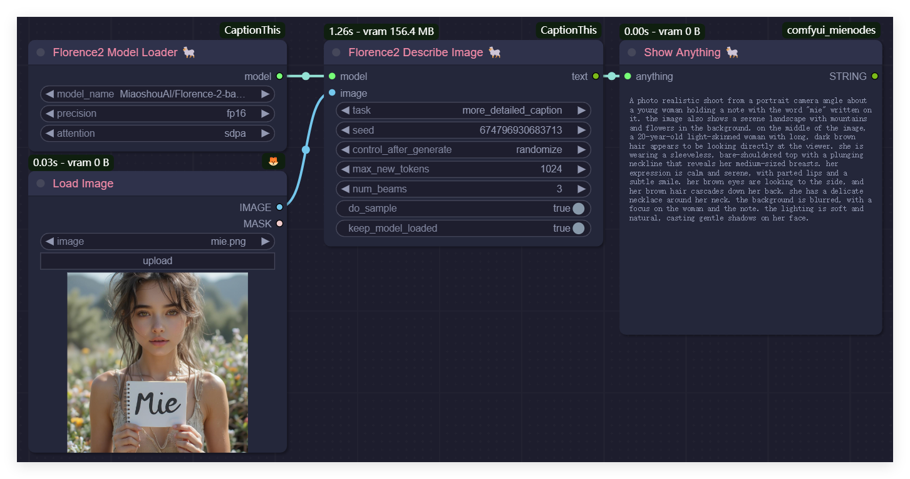

# ComfyUI-CaptionThis

[English](README.md) | [简体中文](README_CN.md)

**ComfyUI-CaptionThis** is a flexible tool for generating image captions, supporting several powerful captioning models such as **Janus Pro** and **Florence2**, with plans to integrate more models like **JoyCaption** and other future developments. This tool aims to simplify workflows for **image-to-image tasks** and **LoRA dataset preparation** or similar fine-tuning processes, providing an intuitive way to describe individual images or batch process entire directories.

---

## Important Updates

* **2025/02/16**: Added support for the **Florence2** model.
* **2025/02/15**: Added support for the **Janus Pro** model.

---

## Workflow

A **ShowText** or **DisplayText** node is required to display the results of command execution. However, ComfyUI currently does not provide a native node for this purpose. In my example, I used the self-implemented **MieNodes** ([GitHub Repo](https://github.com/MieMieeeee/ComfyUI-MieNodes)), which I highly recommend. It’s easy to install, has no dependencies, and includes many caption-related file operation nodes.

### Describe an Image Using Janus Pro


### Describe an Image Using Florence2


### Generate Captions for All Images in a Directory Using Janus Pro


**Before:**


**After:**


### Generate Captions for All Images in a Directory Using Florence2


**The process is the same as Janus Pro.**

---

## Installation

### Install via ComfyUI Manager (Recommended)
1. Install **ComfyUI-Manager**.
2. Search for "CaptionThis" in the manager.
3. Click **Install**.

---

## Model Download

Currently, all models are downloaded directly from HuggingFace (or via `hf_mirror` if you specify the environment variable `HF_ENDPOINT=https://hf-mirror.com`). Alternatively, you can manually download the models and place them in the directories outlined below.

### Janus Pro
- Download the models:
  - [Janus-Pro-1B](https://huggingface.co/deepseek-ai/Janus-Pro-1B)
  - [Janus-Pro-7B](https://huggingface.co/deepseek-ai/Janus-Pro-7B)
- Place the models in the directory `ComfyUI/models/Janus-Pro/` as follows:
  ```
  ComfyUI/models/Janus-Pro/Janus-Pro-1B/
  ComfyUI/models/Janus-Pro/Janus-Pro-7B/
  ```

### Florence2
- Download the models:
  - [Florence-2-base](https://huggingface.co/microsoft/Florence-2-base)
  - [Florence-2-base-ft](https://huggingface.co/microsoft/Florence-2-base-ft)
  - [Florence-2-large](https://huggingface.co/microsoft/Florence-2-large)
  - [Florence-2-large-ft](https://huggingface.co/microsoft/Florence-2-large-ft)
  - [Florence-2-base-PromptGen-v1.5](https://huggingface.co/MiaoshouAI/Florence-2-base-PromptGen-v1.5)
  - [Florence-2-large-PromptGen-v1.5](https://huggingface.co/MiaoshouAI/Florence-2-large-PromptGen-v1.5)
  - [Florence-2-base-PromptGen-v2.0](https://huggingface.co/MiaoshouAI/Florence-2-base-PromptGen-v2.0)
  - [Florence-2-large-PromptGen-v2.0](https://huggingface.co/MiaoshouAI/Florence-2-large-PromptGen-v2.0)
- Place the models in the directory `ComfyUI/models/LLM/` as follows:
  ```
  ComfyUI/models/LLM/Florence-2-base/
  ComfyUI/models/LLM/Florence-2-base-ft/
  ComfyUI/models/LLM/Florence-2-large/
  ComfyUI/models/LLM/Florence-2-large-ft/
  ComfyUI/models/LLM/Florence-2-base-PromptGen-v1.5/
  ComfyUI/models/LLM/Florence-2-large-PromptGen-v1.5/
  ComfyUI/models/LLM/Florence-2-base-PromptGen-v2.0/
  ComfyUI/models/LLM/Florence-2-large-PromptGen-v2.0/
  ```

---

## Features

1. **Single Image Description**
   Generate detailed captions for an individual image using your chosen model. Users can upload an image and optionally provide specific prompts or guiding questions to enrich the output.

2. **Batch Caption Generation**
   Automatically generate captions for multiple images within a specified directory. Each image will have its corresponding description saved as a `.txt` file, streamlining the process of dataset preparation.

3. **Multi-Model Support**
   The system is designed to support multiple captioning models, giving users the flexibility to choose based on their specific tasks. Currently, the tool supports **Janus Pro** and **Florence2**, with plans for future updates to include additional models and expand functionality further.

---

## Coming Soon

- Integration of new models (e.g., **JoyCaption**) to further enhance the tool’s capabilities and support a broader range of use cases.
- Advanced configuration options to fine-tune caption outputs and tailor them to user-specific requirements.

---

## Credits

Special thanks go to:
- [DeepSeek-AI](https://github.com/deepseek-ai/Janus) for providing the robust **Janus Pro** model.
- [CY-CHENYUE](https://github.com/CY-CHENYUE/ComfyUI-Janus-Pro) and [kijai](https://github.com/kijai/ComfyUI-Florence2) for their practical implementations of **Janus Pro** and **Florence2** in respective plugins, which served as key references and inspiration for integrating these models into this project.

Building upon these contributions, this project introduces a refined **multi-model architecture**, empowering users to select the most appropriate model based on their specific needs.

---

## Contact

- **Bilibili**: [@黎黎原上咩](https://space.bilibili.com/449342345)
- **YouTube**: [@SweetValberry](https://www.youtube.com/@SweetValberry)
