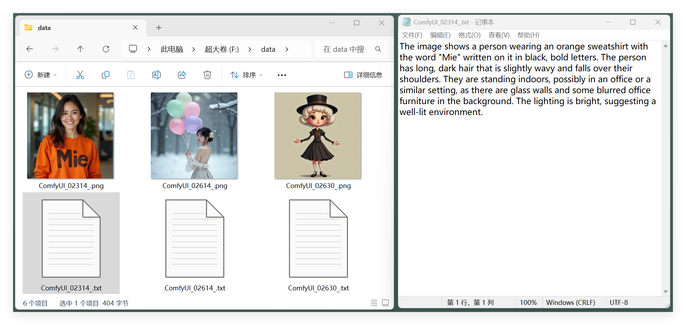

# ComfyUI-CaptionThis  

[English](README.md) | [简体中文](README_CN.md)  

**ComfyUI-CaptionThis** 是一个灵活的图像描述生成工具，支持多个强大的描述模型，例如 **Janus Pro** 和 **Florence2**，并计划集成更多模型（如 **JoyCaption** 和其他未来发展模型）。该工具旨在简化 **图像生成图像任务** 和 **LoRA 数据集准备** 或类似微调过程中的工作流程，为单张图像描述或批量处理整个目录提供直观操作方式。  

---

## 工作流程  

在此需要一个 **ShowText** 或 **DisplayText** 节点来显示命令执行的结果。然而，ComfyUI 目前并未原生提供此类节点。在我的示例中，我使用了自定义实现的 **MieNodes**（[GitHub 仓库](https://github.com/MieMieeeee/ComfyUI-MieNodes)），我强烈推荐该工具。它易于安装，无需任何依赖，并包括许多与描述文件相关的操作节点。  

### 使用 Janus Pro 描述单张图像  
  

### 使用 Florence2 描述单张图像  
  

### 使用 Janus Pro 为目录中的所有图像生成描述  
  

**执行前：**  
  

**执行后：**  
  

### 使用 Florence2 为目录中的所有图像生成描述  
  

**操作方式与 Janus Pro 类似**  

---

## 功能特色  

1. **单张图像描述**  
   使用指定模型为单张图像生成详细的描述。用户可以输入图片，并可选择提供特定的提示或引导性问题以丰富描述内容。  

2. **批量生成描述**  
   针对指定目录中的多张图像自动生成描述。每张图像的对应描述都会保存为 `.txt` 文件，从而高效地完成数据集准备工作。  

3. **多模型支持**  
   该系统设计能集成多种描述模型，用户可根据任务灵活选择。目前支持 **Janus Pro** 和 **Florence2**，未来更新将引入更多模型以扩展功能和适用场景。  

---

## 即将推出  

- 集成更多模型（如 **JoyCaption**），进一步提升功能，适应更多用例需求。  
- 提供高级配置选项，可根据用户需求微调生成的描述内容。  

---

## 致谢  

特别感谢：  
- [DeepSeek-AI](https://github.com/deepseek-ai/Janus) 提供强大的 **Janus Pro** 模型；  
- [CY-CHENYUE](https://github.com/CY-CHENYUE/ComfyUI-Janus-Pro) 和 [kijai](https://github.com/kijai/ComfyUI-Florence2) 在其插件中对 **Janus Pro** 和 **Florence2** 的应用实现，这些为模型集成与功能设计提供了重要参考与灵感。  

基于这些贡献和实践，该项目引入了改进的 **多模型架构**，允许用户根据具体需求选择最合适的模型。  

---

## 联系方式  

- **Bilibili**: [@黎黎原上咩](https://space.bilibili.com/449342345)  
- **YouTube**: [@SweetValberry](https://www.youtube.com/@SweetValberry)  
