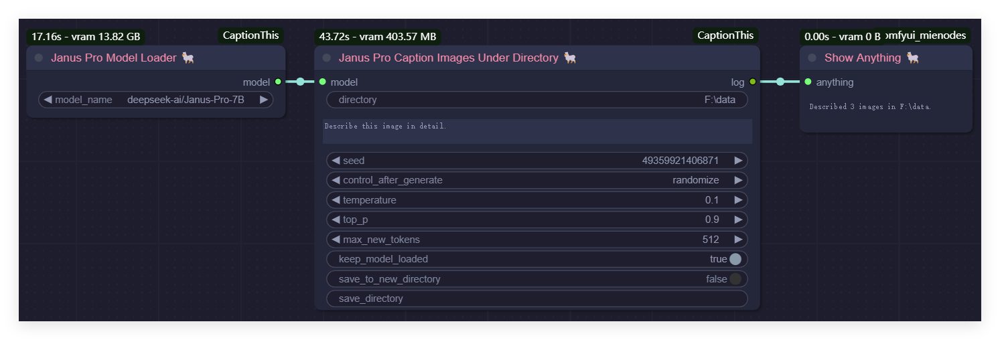
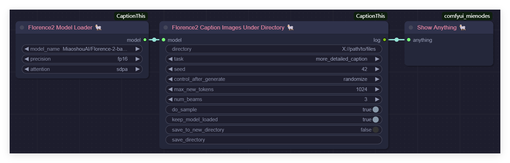

# ComfyUI-CaptionThis

[English](README.md) | [简体中文](README_CN.md)

**ComfyUI-CaptionThis** 是一个灵活的图像描述生成工具，支持多个强大的描述模型，例如 **Janus Pro** 和 **Florence2**，未来计划集成更多模型（如 **JoyCaption** 及其他新模型）。该工具旨在简化 **图像生成图像任务** 和 **LoRA 数据集准备** 或类似微调过程中的工作流程，提供一种直观的方法来描述单张图像或批量处理整个目录。

---

## 重要更新

* **2025/02/16**: 增加了对 **Florence2** 模型的支持。
* **2025/02/15**: 增加了对 **Janus Pro** 模型的支持。

---

## 工作流程

在使用工具时，需要一个 **ShowText** 或 **DisplayText** 节点来显示命令的执行结果。然而，由于 ComfyUI 当前未提供原生支持此类节点，推荐使用我实现的 **MieNodes**（[GitHub 仓库](https://github.com/MieMieeeee/ComfyUI-MieNodes)）。该工具安装简单，无需依赖，且包括许多与描述生成相关的文件操作节点。

### 使用 Janus Pro 描述单张图像


### 使用 Florence2 描述单张图像


### 使用 Janus Pro 为目录中的所有图像生成描述


**生成前：**


**生成后：**


### 使用 Florence2 为目录中的所有图像生成描述


**操作方式与 Janus Pro 相同。**

---

## 安装方法

### 通过 ComfyUI Manager 安装（推荐）
1. 安装 **ComfyUI-Manager**。
2. 在 Manager 中搜索 "CaptionThis"。
3. 点击 **Install** 安装。

---

## 模型下载

目前，所有模型都从 HuggingFace 下载（如果指定了环境变量 `HF_ENDPOINT=https://hf-mirror.com`，则从 `hf_mirror` 镜像下载）。当然，您也可以手动下载并放置到下面指定的目录中。

### Janus Pro 模型
- 下载模型：
  - [Janus-Pro-1B](https://huggingface.co/deepseek-ai/Janus-Pro-1B)
  - [Janus-Pro-7B](https://huggingface.co/deepseek-ai/Janus-Pro-7B)
- 将模型文件放置在目录 `ComfyUI/models/Janus-Pro/` 中，路径结构如下：
  ```
  ComfyUI/models/Janus-Pro/Janus-Pro-1B/
  ComfyUI/models/Janus-Pro/Janus-Pro-7B/
  ```

### Florence2 模型
- 下载模型：
  - [Florence-2-base](https://huggingface.co/microsoft/Florence-2-base)
  - [Florence-2-base-ft](https://huggingface.co/microsoft/Florence-2-base-ft)
  - [Florence-2-large](https://huggingface.co/microsoft/Florence-2-large)
  - [Florence-2-large-ft](https://huggingface.co/microsoft/Florence-2-large-ft)
  - [Florence-2-base-PromptGen-v1.5](https://huggingface.co/MiaoshouAI/Florence-2-base-PromptGen-v1.5)
  - [Florence-2-large-PromptGen-v1.5](https://huggingface.co/MiaoshouAI/Florence-2-large-PromptGen-v1.5)
  - [Florence-2-base-PromptGen-v2.0](https://huggingface.co/MiaoshouAI/Florence-2-base-PromptGen-v2.0)
  - [Florence-2-large-PromptGen-v2.0](https://huggingface.co/MiaoshouAI/Florence-2-large-PromptGen-v2.0)
- 将模型文件放置在目录 `ComfyUI/models/Florence2/` 中，路径结构如下：
  ```
  ComfyUI/models/Florence2/Florence-2-base/
  ComfyUI/models/Florence2/Florence-2-base-ft/
  ComfyUI/models/Florence2/Florence-2-large/
  ComfyUI/models/Florence2/Florence-2-large-ft/
  ComfyUI/models/Florence2/Florence-2-base-PromptGen-v1.5/
  ComfyUI/models/Florence2/Florence-2-large-PromptGen-v1.5/
  ComfyUI/models/Florence2/Florence-2-base-PromptGen-v2.0/
  ComfyUI/models/Florence2/Florence-2-large-PromptGen-v2.0/
  ```

---

## 功能特点

1. **单张图像描述**
   使用所选模型为单张图像生成详细描述。用户可以输入图像，同时可以选择提供特定提示或问题来丰富输出内容。

2. **批量描述生成**
   针对目录中的多张图像自动生成描述。每张图像的描述内容都会保存为 `.txt` 文件，从而高效地完成数据集准备工作。

3. **支持多种模型**
   该系统支持多种图像描述生成模型，用户可以根据具体任务自由选择。目前支持 **Janus Pro** 和 **Florence2** 模型，未来版本将引入更多模型，进一步扩展功能和适用场景。

---

## 即将推出

- 集成更多模型（例如 **JoyCaption**），进一步增强工具的能力，支持更广泛的使用场景。
- 提供高级配置选项，允许用户根据需求微调描述内容的生成方式。

---

## 特别鸣谢

特别感谢以下资源和贡献者：
- [DeepSeek-AI](https://github.com/deepseek-ai/Janus) 提供的高性能 **Janus Pro** 模型；
- [CY-CHENYUE](https://github.com/CY-CHENYUE/ComfyUI-Janus-Pro) 和 [kijai](https://github.com/kijai/ComfyUI-Florence2) 分别实现了对 **Janus Pro** 和 **Florence2** 模型的集成插件，这些为模型集成与功能设计提供了重要参考和启发。

基于上述优秀的贡献，本项目引入了改进的 **多模型架构**，支持用户根据需求选择最适合的模型。

---

## 联系方式

- **Bilibili**: [@黎黎原上咩](https://space.bilibili.com/449342345)
- **YouTube**: [@SweetValberry](https://www.youtube.com/@SweetValberry)
